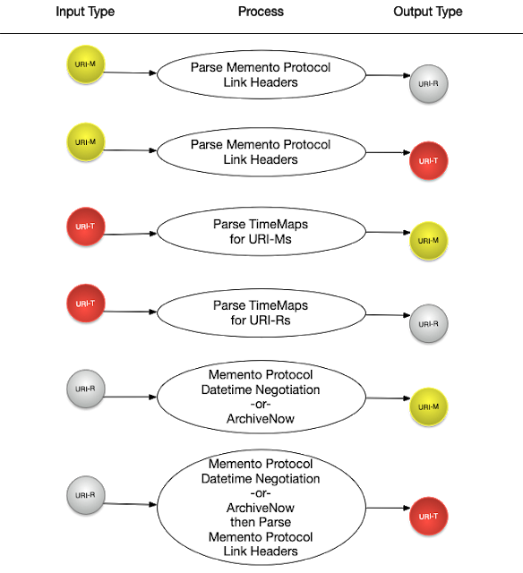

Advanced Actions
================

.. note::
    All examples on this page assume that the ``HC_CACHE_STORAGE`` variable has been set. If you do not know what this means, read the :ref:`caching_and_being_nice` section first.

To build your own sampling algorithms or explore a collection in different ways, Hypercane also offers the advanced actions of:

* :ref:`identify` - for discovering one Memento object from another
* :ref:`filter` - for filtering the documents from the input based on some criteria
* :ref:`cluster` - for clustering the documents from the input based on an algorithm and features
* :ref:`score` - for scoring the documents from the input based on some scoring function
* :ref:`order` - for ordering the documents in the input based on some feature

.. _identify:

``identify``
------------

The ``identify`` action produces one type of Memento Protocol object from another. With identify, a user can submit a list of URI-Ts and get the full list of URI-Ms or URI-Rs discovered in those TimeMaps. They can also submit a list of URI-Ms and produce the corresponding URI-Ts or URI-Rs. Hypercane discovers this information via the `Memento Protocol <https://datatracker.ietf.org/doc/html/rfc7089>`_.

For example, to identify the mementos in Trove collection 13524:

.. code-block:: text

    hc identify mementos -i trove -a 13524 -o mementos.tsv

or to identify the TimeMaps in Archive-It collection 8788:

.. code-block:: text

    hc identify timemaps -i archiveit -a 8788 -o timemap-output-file.tsv

or to identify the original resources based on the mementos in file *mementos.tsv*:

.. code-block:: text

    hc identify original-resources -i mementos -a mementos.tsv -o original-resources.tsv

or discover the TimeMaps for the mementos in the file *mementos.tsv*:

.. code-block:: text

    hc identify timemaps -i mementos -a mementos.tsv -o timemaps.tsv

The `identify` action supports the following criteria:

* ``mementos`` - discover all mementos in the input; for performance, it only discovers URI-Ms and assumes that the archive reports the mementos accurately
* ``timemaps`` - discover all timemaps in the input; for performance, it only discovers URI-Ts and assumes that the archive reports the TimeMaps accurately
* ``original-resources`` - discovers all original-resources in the input

The following diagram indicates how Hypercane handles discovering one type of memento object based on another.

Type ``hc identify --help`` for more information on all available options. The ``--help`` argument can also be supplied to a single option for more information, e.g., ``hc identify mementos --help``.

.. _filter:

``filter``
----------

Hypercane's :ref:`filter` action accepts either ``include-only`` or ``exclude`` as subactions. These modifiers then apply to the criteria specified. For example, to discover mementos in Archive-It collection 8788 and list only those in English and German, run the following:

.. code-block:: text

    hc filter include-only languages --lang en,es -i archiveit -a 8788 -o english-spanish-mementos.txt

or to exclude mementos containing the string *cheese* from a list of mementos:

.. code-block:: text

    hc filter exclude containing_pattern --pattern 'cheese' -i mementos -a mementofile.tsv -o mementos-without-cheese.tsv

The ``filter`` action supports the following criteria for ``include-only``:

* ``on-topic`` - only list mementos that are on-topic
* ``non-duplicates`` - only list mementos that are not duplicates
* ``containing-pattern`` - only list mementos where their content contains the given pattern
* ``languages`` - only list mementos written in the given languages
* ``near-datetime`` - only list mementos between the datetimes provided, needed for SPFT stories 
* ``containing-url-pattern`` - only list mementos where the URI-R contains the given pattern, needed for FPST stories
* ``highest-score-per-cluster`` - only list the highest ranking memento in each cluster, requires that the input contain clusters generated by the \texttt{cluster} action
* ``largest-clusters`` - only list mementos from the $k$ largest clusters, requires that the input contain clusters generated by the \texttt{cluster} action
* ``score`` - only list mementos that match a given score range, requires that the input contains scoring information generated by the \texttt{score} action

Type ``hc filter include-only --help`` for more information on the available options for each criteria. The ``--help`` argument can also be supplied to a single option for more information, e.g., ``hc filter include-only languages --help``.

The following criteria exist for ``exclude``:

* ``languages`` - exclude mementos with the given languages (specified with --lang)
* ``off-topic`` - execute the Off-Topic Memento Toolkit to exclude off-topic mementos
* ``near-duplicates`` - employ Simhash to exclude mementos that are near-duplicates
* ``containing-pattern`` - exclue mementos that contain the given regular experession pattern

Type ``hc filter exclude --help`` for more information on the available options for each criteria. The ``--help`` argument can also be supplied to a single option for more information, e.g., ``hc filter exclude off-topic --help``.

.. _cluster:

``cluster``
-----------

Clustering divides a collection into meaningful sub-collections for further processing, such as scoring and filtering, to produce exemplars. Some clustering functions, like `dbscan` and `kmeans` require that the user specify a feature through the `--feature` argument.

For example, to :ref:`cluster` a the mementos from the file *mdt-slices.tsv* by the feature TF Simash using the clustering algorithm *DBSCAN*, type the following:

.. code-block:: text

    hc cluster dbscan -i mementos -a mdt-slices.tsv -o sliced-and-clustered.tsv --feature tf-simhash

or to cluster all of the mementos in Pandora Subject 82 by their original resource URI-R:

.. code-block:: text

    hc cluster original-resource -i pandora-subject -a 82 -o 82-original-resources.tsv

or to cluster the mementos in Archive-It collection 694 by Latent Dirichlet Allocation:

.. code-block:: text

    hc cluster lda -i archiveit -a 694 -o clustered.tsv 

The following criteria exist for ``cluster``:

* ``time-slice`` - cluster the collection via `AlNoamany's time slicing algorithm <https://doi.org/10.1145/3091478.3091508>`_
* ``dbscan`` - cluster the collection via the user-supplied feature and DBSCAN
* ``lda`` - cluster the collection via Latent Dirchlet Allocation (LDA) topic modeling
* ``kmeans`` - cluster the collection via the user-supplied feature and K-means clustering
* ``domainname`` - cluster the collection by the domainname of each URI-R
* ``original-resource`` - cluster the collection by URI-R

Type ``hc cluster --help`` for more information on the available options for each criteria. The ``--help`` argument can also be supplied to a single option for more information, e.g., ``hc cluster lda --help``.

.. _score:

``score``
---------

Scoring is also an essential staple of summarization to help rank multiple candidates. Hypercane's `score` action allows the user to choose from multiple scoring criteria.

To score the mementos in the file *input_mementos.tsv* by `AlNoamany's scoring function <https://doi.org/10.1145/3091478.3091508>`_

.. code-block:: text

    hc score dsa1-scoring -i mementos -a input_mementos.tsv -o scored_mementos.tsv

or to score the mementos in Trove collection 13123 using `BM25 <https://en.wikipedia.org/wiki/Okapi_BM25>`_ with the query *cheese*:

.. code-block:: text

    hc score bm25 -i trove -a 13123 -o scored_mementos.tsv --query "cheese"

or to score the mementos found in the TimeMaps in the file *timemaps.tsv* by how well those mementos create a card on Facebook and Twitter:

.. code-block:: text

    hc score simple-card-score -i timemaps -a timemaps.tsv -o scored_mementos.tsv

The following criteria are available for ``score``:

* ``dsa1-score`` - `AlNoamany's scoring function <https://doi.org/10.1145/3091478.3091508>`_; requires a `Memento Damage <http://memento-damage.cs.odu.edu/>`_ server
* ``bm25`` - score each memento by how well they match a given term as per `BM25 <https://en.wikipedia.org/wiki/Okapi_BM25>`_; requires that the user specify a term via ``--query``
* ``image-count`` - score each memento by the number of images in each memento; this can be useful for image-rich story types
* ``simple-card-score`` - score each memento by how well it would be represented as a social card on Facebook and Twitter as applied by `Jones et al. in 2021 <https://arxiv.org/abs/2104.04116>`_
* ``path-depth`` - score each memento by its path depth, as defined by `McCown et al. in 2015 <https://arxiv.org/abs/cs/0511077>`_
* ``url-category-score`` - score each memento the web page categories established by `Padia et al. <https://doi.org/10.1145/2232817.2232821>`_

Type ``hc score --help`` for more information on the available options for each criteria. The ``--help`` argument can also be supplied to a single option for more information, e.g., ``hc score bm25 --help``.

.. _order:

``order``
---------

Sorting content is critical for conveying meaning. For storytelling, we often want articles to flow in chronological order.

To order mementos in *scored_mementos.tsv* according to the publication date as extracted by `newspaper3k <https://newspaper.readthedocs.io/en/latest/>`_, otherwise by memento-datetime:

.. code-block:: text

    hc order pubdate-else-memento-datetime -i mementos -ia scored_mementos.tsv -o ordered_mementos.tsv

The following criteria are available for ``order``:

* ``pubdate-else-memento-datetime`` - order mementos, if possible, by publication date as extracted by `newspaper3k <https://newspaper.readthedocs.io/en/latest/>`_, otherwise fall back to memento-datetime
* ``memento-datetime`` - order mementos by memento-datetime
* ``score`` - order mementos by a given score, as produced by the :ref:`score` action

Type ``hc order --help`` for more information on the available options for each criteria. The ``--help`` argument can also be supplied to a single option for more information, e.g., ``hc order memento-datetime --help``.
