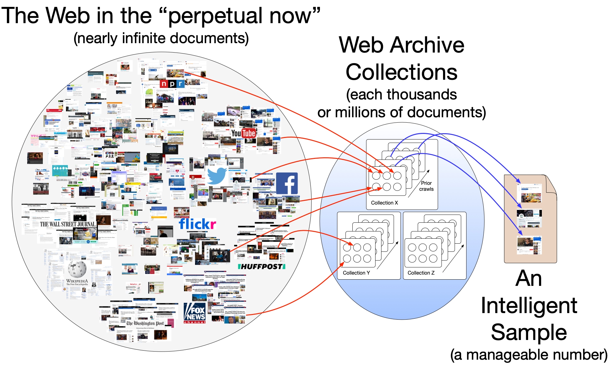

Hypercane: Intelligent Samping of Web Archive Collections
=========================================================

What tool can we rely on to automate the selection of mementos for summarizations and other purposes? Hypercane.

Humans can choose mementos from a collection, but doing so is difficult if they are unfamiliar with the collection. In the appendix of the `preprint version <https://arxiv.org/abs/1905.11342>`_ of *Social Cards Probably Provide For Better Understanding of Web Archive Collections*, we detail how difficult it is to understand a web archive collection with the existing Archive-It interface. The issue is scale. Most web archive collections consist of thousands of documents. In that same work, we show that most collections contain insufficient metadata to assist users in making choices about which mementos to sample. Depending on the algorithm chosen, Hypercane takes into account `the structural features <http://doi.org/10.17605/OSF.IO/EV42P>`_ of the collection and the content of the collection's mementos to make its decisions.

Hypercane is a command-line utility for sampling archived web pages (**mementos**) from a web archive collection. Hypercane leverages the `Memento Protocol <https://tools.ietf.org/html/rfc7089>`_ to discover resources in web archives so that a user can sample a subset of documents. With Hypercane a user can do things like search a subset of mementos, produce a sample for automated storytelling, or convert a set of memento URLs (URI-Ms) into WARCs for processing with other tools.

The core actions of Hypercane are:

* ``sample`` - for creating a sample of a collection
* ``report`` - for generating a report on collection metadata, named entities, curation behavior, and more
* ``synthesize`` - for generating output for other tools, like `Archives Unleashed Toolkit <https://github.com/archivesunleashed/aut>`_ or `Raintale <https://oduwsdl.github.io/raintale/>`_

To create their own algorithms, Hypercane also supports the following advanced actions:

* ``identify`` - for discovering one Memento object from another
* ``filter`` - for filtering the documents from the input based on some criteria
* ``cluster`` - for clustering the documents from the input based on an algorithm and features
* ``score`` - for scoring the documents from the input based on some scoring function
* ``order`` - for ordering the documents in the input based on some feature

Hypercane is a research project and is rather volatile. These actions will remain stable, but additional options are being added all of the time. This documentation will not attempt to detail how every action can be used. Instead, this documentation will detail common recipes and other insights as this project progresses. Help for each command is available by typing ``--help`` after the command, like so:

.. code-block:: text

   # hc report --help

   'hc report' is used to print reports about web archive collections

   Supported commands:
   * metadata - for discovering the metadata associated with seeds
   * image-data - for generating a report of the images associated with the mementos found in the input
   * terms - generates corpus term frequency, probability, document frequency, inverse document frequency, and corpus TF-IDF for the terms in the collection
   * entities - generates corpus term frequency, probability, document frequency, inverse document frequency, and corpus TF-IDF for the named entities in the collection
   * seed-statistics - calculates metrics on the original resources discovered from the input
   * growth - calculates metrics based on the growth of the TimeMaps discovered from the input

   Examples:

   hc report metadata -i archiveit -a 8788 -o 8788-metadata.json -cs mongodb://localhost/cache

   hc report entities -i mementos -a memento-file.tsv -o entity-report.json

   hc report seed-statistics -i original-resources -a urirs.tsv -o seedstats.json

This documentation is not yet complete. To see what Hypercane can do, please read the following blog posts:

* `Hypercane Part 1: Intelligent Sampling of Web Archive Collections <https://ws-dl.blogspot.com/2020/06/2020-06-03-hypercane-part-1-intelligent.html>`_
* `Hypercane Part 2: Synthesizing Output For Other Tools <https://ws-dl.blogspot.com/2020/06/2020-06-10-hypercane-part-2.html>`_
* `Hypercane Part 3: Building Your Own Algorithms <https://ws-dl.blogspot.com/2020/06/2020-06-17-hypercane-part-3-building.html>`_

.. toctree::
   :maxdepth: 2

   installation
   license

