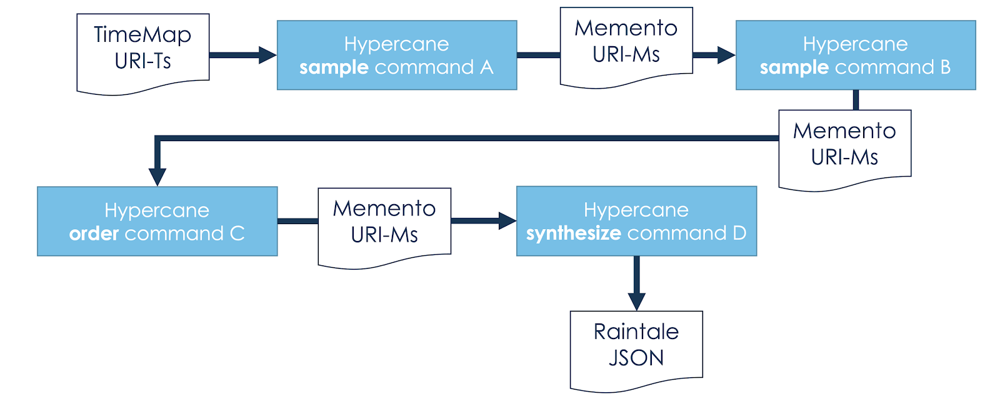

Inputs and Outputs
==================

.. attention::
    All examples on this page assume that the ``HC_CACHE_STORAGE`` variable has been set. If you do not know what this means, read the :ref:`caching_and_being_nice` section first.

All Hypercane commands specify input types with `-i` and and an output file or directory with `-o`. The subsection below contains the list of possible values for `-i` and how to use them.

Input Types
-----------

Hypercane supports several types of input across all of its commands. An input type is supplied with the ``-i`` argument.  For each input type, the ``-a`` argument specifies the collection identifier or the file containing the input. In the following example, we sample 28 mementos from collection 13742, specified by ``-a``, archived by `Trove <https://trove.nla.gov.au/>`_, specified by ``-i``:

.. code-block:: text

    hc sample true-random -k 28 -i trove -a 13742 -o random-sample.tsv

All Hypercane commands accept the following values for the ``-i`` argument to specify the type of input to be provided in the ``-a`` argument:

* ``archiveit`` -  the input is an `Archive-It <https://archive-it.org/>`_  collection identifier
* ``trove`` -  the input is a `Trove <https://trove.nla.gov.au/>`_ collection identifier
* ``pandora-collection`` -  the input is a `Pandora <http://pandora.nla.gov.au/>`_ collection identifier
* ``pandora-subject`` -  the input is a `Pandora <http://pandora.nla.gov.au/>`_ subject identifier
* ``mementos`` -  the input is a tab-separated file containing a list of mementos identified by their URI-Ms
* ``timemaps`` -  the input is a tab-separated file containing a list of TimeMaps identified by their URI-Ts
* ``original-resources`` -  the input is a tab-separated file containing a list of live web resources identified by their URI-Rs

Below are some examples of using the different input types with different Hypercane commands.

1. Randomly sample 10 mementos from Archive-It collection 8788

.. code-block:: text

    hc sample true-random -i archiveit -a 8788 -o seed-output-file.txt -k 10

2. Use the DSA1 algorithm to sample mementos from the TimeMaps found in the file timemaps.tsv

.. code-block:: text

    hc sample dsa1 -i timemaps -a timemaps.tsv -o dsa1-sample.tsv

3. Generate an entity report for the mementos in the file memento-file

.. code-block:: text

    hc report entities -i mementos -a memento-file.tsv -o entity-report.json

4. Generate a metadata report for Trove collection 13742

.. code-block:: text

    hc report metadata -i trove -a 13742 -o 13742-metadata.json

5. Synthesize a directory containing mementos from the TimeMaps in timemap-file.tsv

.. code-block:: text

    hc synthesize files -i timemaps -a timemap-file.tsv -o output-directory

6. Save the URI-Ms of all mementos in Pandora Collection 10121 into the file mementos.tsv

.. code-block:: text

    hc identify mementos -i pandora-collection -a 10121 -o mementos.tsv

The power of Hypercane: outputs are just future inputs
------------------------------------------------------

With the exception of the :ref:`synthesize` and :ref:`report` actions, all other actions produce a tab-separated file containing a list of memento URI-Ms, TimeMap URI-Ts, or original resource URI-Rs. All Hypercane commands will also accept this file format, allowing most Hypercane commands to feed data into each other. As shown in the hypothetical diagram below, we can execute a sample action using one algorithm and feed the result into another sample action using a different algorithm. The resulting mementos can then be fed into an order action before finally feeding the result into a :ref:`synthesize` action to generate input for a Raintale story containing only those mementos. Many combinations of actions are possible.

.. centered::
    A hypothetical Hypercane workflow shows a user providing a list of TimeMap URI-Ts as input to a sample command. The output list of Memento URI-Ms from that command can be used as input to subsequent commands who then feed others.

For example, one can acquire the list of TimeMaps from Archive-It collection 694 and save it to a file named `694-timemaps.tsv`:

.. code-block:: text

    hc identify timemaps -i archiveit -a 694 -o 694-timemaps.tsv

and then feed that into a :ref:`filter` action to acquire only the on-topic mementos from those TimeMaps:

.. code-block:: text

    hc filter exclude off-topic -i timemaps -a 694-timemaps.tsv -o 694-ontopic.tsv

and then :ref:`score` those mementos by their path-depth:

.. code-block:: text

    hc score path-depth -i mementos -a 694-ontopic.tsv -o scored_mementos.tsv

and also generate an entity :ref:`report` on those mementos:

.. code-block:: text

    hc report entites -i mementos -a scored_mementos.tsv -o entity-report.json

This is how the `dsa1` algorithm within :ref:`sample` is executed, as a series of commands that feed data into each other.
